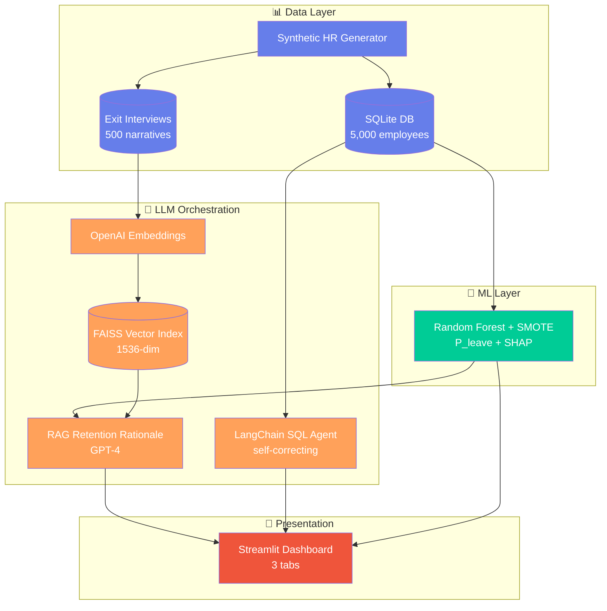

# 🏗️ Architecture Diagram — Spec Sheet

> Build this in **Excalidraw** (free, no signup): https://excalidraw.com/
> Or use Mermaid/draw.io if you prefer.
> Export as PNG (transparent background, 2× resolution).
> Save to: `doc/architecture.png` and `paper/figures/architecture.png`

---

## 🎯 What the diagram needs to show

A single-glance architecture that a hiring manager can absorb in 8 seconds.

---

## 📐 Layout — top to bottom, left to right

```
┌──────────────────────────── DATA LAYER ────────────────────────────┐
│                                                                     │
│   [Synthetic HR Generator] ──┐                                      │
│   (data_generator.py)        │                                      │
│                              ▼                                      │
│   [SQLite Database]   [Exit-Interview Corpus]                       │
│   (hr_enterprise.db)  (500 narratives)                              │
│         │                    │                                      │
└─────────│────────────────────│──────────────────────────────────────┘
          │                    │
          │                    ▼
          │       [OpenAI Embeddings]
          │       (text-embedding-3-small)
          │                    │
          │                    ▼
          │       ┌──────────────────────┐
          │       │   FAISS Vector Index │
          │       │  (1,536-dim, IP)     │
          │       └──────────────────────┘
          │                    │
          ▼                    │
┌──── ML LAYER ────┐           │
│                  │           │
│ Random Forest    │           │
│   + SMOTE        │           │
│ (predictive_     │           │
│  engine.py)      │           │
│                  │           │
│ Output: P(leave) │           │
│ + SHAP attribution           │
└────────┬─────────┘           │
         │                     │
         ▼                     ▼
┌─────── AI / LLM ORCHESTRATION LAYER ────────┐
│                                              │
│  [LangChain SQL Agent]    [RAG Generator]   │
│  - schema injection       - SHAP-driven      │
│  - self-correction          query            │
│  - GPT-3.5 / GPT-4o-mini  - GPT-4 retention  │
│                             rationale        │
└──────────────────┬──────────────────────────┘
                   │
                   ▼
┌──────── PRESENTATION LAYER ────────┐
│                                     │
│  Streamlit Dashboard (dashboard.py)│
│  ┌─────────────────────────────┐   │
│  │ Tab 1: Executive Dashboard  │   │
│  │ Tab 2: Detailed Analytics   │   │
│  │ Tab 3: AI Assistant         │   │
│  └─────────────────────────────┘   │
│                                     │
│  HR Manager / Analyst              │
└─────────────────────────────────────┘
```

---

## 🎨 Visual style guide

- **Color palette:**
  - Data layer: `#667eea` (purple-blue)
  - ML layer: `#00CC96` (green — "trained model")
  - LLM/AI layer: `#FFA15A` (orange — "AI orchestration")
  - Presentation layer: `#EF553B` (red — "user-facing")
- **Boxes:** rounded corners, subtle drop shadow
- **Arrows:** thin, dark gray (`#444`), labeled where useful
- **Font:** Inter or system sans-serif
- **Title:** `AttriSense — System Architecture` at top
- **Footer:** `© 2026 Sharada Dogiparthi · MIT License`

---

## 📦 Three deliverables (different formats for different uses)

1. **`doc/architecture.png`** (2× resolution, transparent BG) → for README and LinkedIn carousel
2. **`paper/figures/architecture.png`** (300 DPI, white BG) → for IEEE paper Fig. 1
3. **`doc/architecture_dark.png`** (dark mode version, optional) → for video B-roll

---

## ⏱️ Time budget

- 30 minutes if you use Excalidraw with the layout above
- Don't overthink it. Ugly-but-clear beats beautiful-but-confusing.
- The goal: a hiring manager screenshots this and pastes it into Slack.

---

## 🎁 Bonus — Mermaid version (if you want code-based)



Save this as `doc/architecture.mmd`. Render at https://mermaid.live → export PNG.
